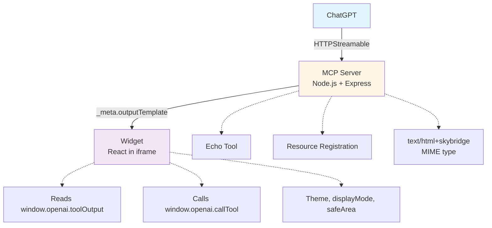
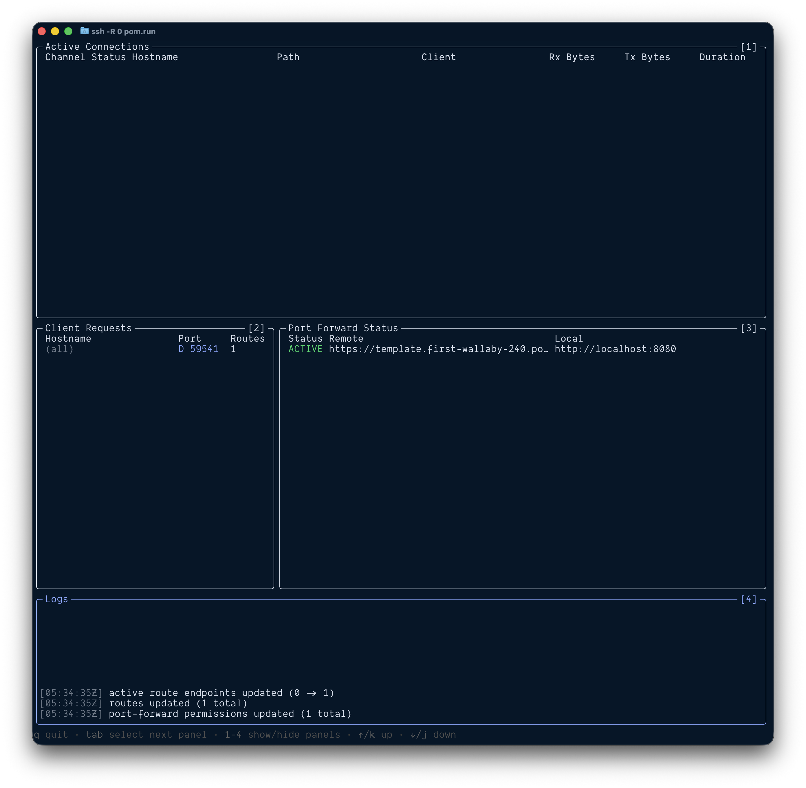
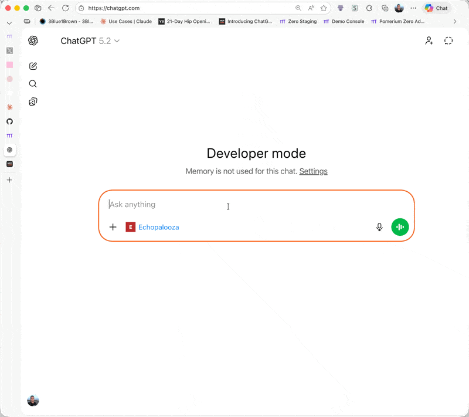

# ChatGPT App Template

A well-architected starter template demonstrating best practices for building [ChatGPT apps](https://developers.openai.com/apps-sdk/) using the [Model Context Protocol](https://modelcontextprotocol.io/) (MCP) with [React](https://react.dev/) widgets. It leverages TypeScript, Tailwind CSS v4, Pino logging, Storybook, and Vitest for a robust development experience.

## Features

- **MCP Server** - Node.js server with base `Server` class (preserves `_meta` fields)
- **Echo Tool** - Example tool with [Zod](https://zod.dev/) validation and widget response
- **React Widgets** - Interactive Echo component with `callTool` demo
- **[Pino](https://getpino.io/) Logging** - Structured logging with pretty printing in development
- **TypeScript** - Strict mode with ES2023 target
- **[Tailwind CSS v4](https://tailwindcss.com/)** - Modern styling with dark mode support
- **[Storybook](https://storybook.js.org/)** - Component development with a11y addon
- **Testing** - [Vitest](https://vitest.dev/) for server and widgets with accessibility checks
- **Build Optimizations** - Parallel builds, content hashing, compression
- **[Docker](https://www.docker.com/)** - Multi-stage builds with health checks
- **Production Ready** - Session management, graceful shutdown, error handling

## Architecture



## Quick Start

**Setup time: ~5 minutes (first time)**

### Prerequisites

- **[Node.js](https://nodejs.org/) 22+** (required for ES2023 support)
  - Verify: `node -v` (should show v22.0.0 or higher)
- **npm 10+** (ships with Node 22)
  - Verify: `npm -v` (should show v10.0.0 or higher)

**Supported platforms:** macOS, Linux, Windows (via WSL2)

### Installation & Setup

```bash
git clone https://github.com/pomerium/chatgpt-app-typescript-template your-chatgpt-app
cd your-chatgpt-app
npm install
npm run dev
```

This starts both the MCP server and widget dev server:

- **MCP Server**: `http://localhost:8080`
- **Widget Assets**: `http://localhost:4444`

> **Note:** The MCP server is a backend service. To test it, follow the ChatGPT connection steps below or use `npm run inspect` for local testing.

You should see output indicating both servers are running successfully:

```
❯ npm run dev

> chatgpt-app-typescript-template@1.0.0 dev
> concurrently "npm run dev:server" "npm run dev:widgets"

[1]
[1] > chatgpt-app-typescript-template@1.0.0 dev:widgets
[1] > npm run dev --workspace=widgets
[1]
[0]
[0] > chatgpt-app-typescript-template@1.0.0 dev:server
[0] > npm run dev --workspace=server
[0]
[1]
[1] > chatgpt-app-widgets@1.0.0 dev
[1] > vite
[1]
[0]
[0] > chatgpt-app-server@1.0.0 dev
[0] > tsx watch src/server.ts
[0]
[1]
[1] Found 1 widget(s):
[1]   - echo
[1]
[1]
[1]   VITE v6.4.1  ready in 151 ms
[1]
[1]   ➜  Local:   http://localhost:4444/
[1]   ➜  Network: use --host to expose
[0] [12:45:12] INFO: Starting ChatGPT App Template server
[0]     port: 8080
[0]     nodeEnv: "development"
[0]     logLevel: "info"
[0]     assetsDir: "/Users/nicktaylor/dev/oss/chatgpt-app-typescript-template/assets"
[0] [12:45:12] INFO: Server started successfully
[0]     port: 8080
[0]     mcpEndpoint: "http://localhost:8080/mcp"
[0]     healthEndpoint: "http://localhost:8080/health"
```

### Connect to ChatGPT

To test your app in ChatGPT, you need to expose your local server publicly. The fastest way is using [Pomerium's SSH tunnel](https://www.pomerium.com/docs/tcp/ssh):

**1. Create a public tunnel** (in a new terminal, keep `npm run dev` running):

```bash
ssh -R 0 pom.run
```

**First-time setup:**

1. You'll see a sign-in URL in your terminal:

   ```
   Please sign in with hosted to continue
   https://data-plane-us-central1-1.dataplane.pomerium.com/.pomerium/sign_in?user_code=some-code
   ```

2. Click the link and sign up
3. Authorize via the Pomerium OAuth flow
4. Your terminal will display connection details:



**2. Find your public URL:**

Look for the **Port Forward Status** section showing:

- **Status**: `ACTIVE` (tunnel is running)
- **Remote**: `https://template.first-wallaby-240.pom.run` (your unique URL)
- **Local**: `http://localhost:8080` (your local server)

**3. Add to ChatGPT:**

1. [Enable ChatGPT apps dev mode](https://platform.openai.com/docs/guides/developer-mode) in your ChatGPT settings
2. Go to: **Settings → Connectors → Add Connector**
3. Enter your Remote URL + `/mcp`, e.g. `https://template.first-wallaby-240.pom.run/mcp`
4. Save the connector

**4. Test it:**

1. Start a new chat in ChatGPT
2. Add your app to the chat
3. Send: `echo today is a great day`
4. You should see the message displayed in an interactive widget



The tunnel stays active as long as the SSH session is running.

### Success! What's Next?

Now that your app is working, you can:

- **[Customize the echo tool](#adding-new-tools)** - Modify the example tool or add your own logic
- **[Create a new widget](#widget-development)** - Build custom UI components for your tools
- **[Test locally](#local-testing-with-mcp-inspector)** - Use `npm run inspect` for debugging without ChatGPT
- **[Deploy to production](#production-deployment)** - Take your app live when ready

## Available Commands

### Development

```bash
# Start everything (server + widgets in watch mode)
npm run dev

# Start only MCP server (watch mode)
npm run dev:server

# Start only widget dev server
npm run dev:widgets

# Test with MCP Inspector
npm run inspect
```

### Building

```bash
# Full production build (widgets + server)
npm run build

# Build only widgets
npm run build:widgets

# Build only server
npm run build:server
```

### Testing

```bash
# Run all tests
npm test

# Run server tests only
npm run test:server

# Run widget tests only
npm run test:widgets

# Run tests with coverage
npm run test:coverage
```

### Code Quality

```bash
# Lint all TypeScript files
npm run lint

# Format code with Prettier
npm run format

# Check formatting without modifying
npm run format:check

# Type check all workspaces
npm run type-check
```

### Storybook

```bash
# Run Storybook dev server
npm run storybook

# Build Storybook for production
npm run build:storybook
```

### Testing Your App

#### 1. Local Testing with MCP Inspector

```bash
npm run inspect
```

This opens a browser interface to:

- List available tools
- Test tool invocations
- Inspect responses and metadata
- Verify widget resources load correctly

#### 2. Connect from ChatGPT

For complete ChatGPT connection instructions, see the [Quick Start: Connect to ChatGPT](#connect-to-chatgpt) section above.

**Already connected?** After making code changes:

1. **Settings → Connectors → Your App → Refresh**
2. This reloads tool definitions and metadata

**Production Setup:**

When deploying to production:

1. Deploy your server to a public URL (see [Production Deployment](#production-deployment))
2. In ChatGPT: **Settings → Connectors → Add Connector**
3. Enter your server URL: `https://your-domain.com/mcp`
4. Test the `echo` tool in ChatGPT

## Project Structure

```
chatgpt-app-template/
├── server/                  # MCP server
│   ├── src/
│   │   ├── server.ts       # Main server with echo tool
│   │   ├── types.ts        # Type definitions
│   │   └── utils/
│   │       └── session.ts  # Session management
│   ├── tests/
│   │   └── echo-tool.test.ts
│   └── package.json        # Server dependencies
│
├── widgets/                 # React widgets
│   ├── src/
│   │   ├── widgets/
│   │   │   └── echo.tsx           # Widget entry (includes mounting code)
│   │   ├── echo/
│   │   │   ├── Echo.tsx           # Shared components
│   │   │   ├── Echo.stories.tsx
│   │   │   └── styles.css
│   │   ├── components/
│   │   │   └── ui/              # ShadCN components
│   │   ├── hooks/
│   │   │   └── use-openai-global.ts
│   │   └── types/
│   │       └── openai.d.ts
│   ├── .storybook/         # Storybook config
│   └── package.json        # Widget dependencies
│
├── assets/                  # Asset build artifacts
│   ├── echo.html
│   ├── echo-[hash].js
│   └── echo-[hash].css
│
├── scripts/
│   └── build-all.mts       # Parallel widget builds
│
├── docker/
│   ├── Dockerfile          # Multi-stage build
│   └── docker-compose.yml
│
└── package.json            # Root workspace
```

## Adding New Tools

### 1. Define Tool Schema

```typescript
// server/src/server.ts

const myTool: Tool = {
  name: 'my_tool',
  description: 'Does something cool',
  inputSchema: {
    type: 'object',
    properties: {
      input: { type: 'string', description: 'Tool input' },
    },
    required: ['input'],
  },
};
```

### 2. Implement Tool Handler

```typescript
// In CallToolRequestSchema handler

if (name === 'my_tool') {
  const args = MyToolInputSchema.parse(request.params.arguments);

  return {
    content: [{ type: 'text', text: 'Result' }],
    structuredContent: {
      result: args.input,
    },
    _meta: {
      outputTemplate: {
        type: 'resource',
        resource: { uri: 'ui://my-widget' },
      },
    },
  };
}
```

### 3. Create Widget

Create `widgets/src/widgets/my-widget.tsx`:

```tsx
// widgets/src/widgets/my-widget.tsx
import { StrictMode } from 'react';
import { createRoot } from 'react-dom/client';
import { useOpenAiGlobal } from '../hooks/use-openai-global';

function MyWidget() {
  const toolOutput = useOpenAiGlobal('toolOutput');
  const theme = useOpenAiGlobal('theme');

  return (
    <div className={theme === 'dark' ? 'dark' : ''}>
      <h1>My Widget</h1>
      <pre>{JSON.stringify(toolOutput, null, 2)}</pre>
    </div>
  );
}

// Mounting code - required at the bottom of each widget file
const rootElement = document.getElementById('my-widget-root');
if (rootElement) {
  createRoot(rootElement).render(
    <StrictMode>
      <MyWidget />
    </StrictMode>
  );
}
```

### 4. Register Widget Resource

```typescript
// In ReadResourceRequestSchema handler

if (uri === 'ui://my-widget') {
  const html = readWidgetHtml('my-widget');
  return {
    contents: [
      {
        uri,
        mimeType: 'text/html+skybridge', // CRITICAL!
        text: html,
      },
    ],
  };
}
```

### 5. Build

```bash
npm run build:widgets
npm run dev:server
```

The build script auto-discovers widgets in `widgets/src/widgets/*.{tsx,jsx}` and bundles them with their mounting code

## Widget Development

### Widget Pattern

Widgets include both the component and mounting code:

**1. Create widget entry point** in `widgets/src/widgets/[name].tsx`:

```tsx
import { StrictMode } from 'react';
import { createRoot } from 'react-dom/client';
import { useOpenAiGlobal } from '../hooks/use-openai-global';

function MyWidget() {
  const toolOutput = useOpenAiGlobal('toolOutput');
  return <div>Widget content</div>;
}

// Mounting code - required
const rootElement = document.getElementById('my-widget-root');
if (rootElement) {
  createRoot(rootElement).render(
    <StrictMode>
      <MyWidget />
    </StrictMode>
  );
}
```

**2. Build discovers and bundles widget**:

```bash
npm run build:widgets
```

**3. Widget available as** `ui://my-widget`

The build system:

- Auto-discovers all files in `widgets/src/widgets/*.{tsx,jsx}`
- Bundles the component and mounting code together
- Creates content-hashed bundles and HTML templates

### window.openai API Reference

#### State & Data

```typescript
const toolOutput = useOpenAiGlobal('toolOutput'); // Tool's structured content
const toolInput = useOpenAiGlobal('toolInput'); // Tool arguments
const widgetState = useOpenAiGlobal('widgetState'); // Persistent state from host
```

**Setting State**: Use `window.openai.setWidgetState(newState)` to persist state.

**State Limits**: Keep `widgetState` under **4,000 tokens** for optimal performance.

#### Context Signals

```typescript
const theme = useOpenAiGlobal('theme'); // 'light' | 'dark'
const displayMode = useOpenAiGlobal('displayMode'); // 'inline' | 'pip' | 'fullscreen'
const maxHeight = useOpenAiGlobal('maxHeight'); // Max height in pixels
const safeArea = useOpenAiGlobal('safeArea'); // Insets for responsive layout
const viewport = useOpenAiGlobal('viewport'); // { width, height }
const locale = useOpenAiGlobal('locale'); // User locale (e.g., 'en-US')
```

#### Runtime APIs

```typescript
// Call other tools from widget
const result = await window.openai?.callTool('tool_name', { arg: 'value' });

// Toggle display mode
await window.openai?.requestDisplayMode({ mode: 'fullscreen' });

// Send follow-up message
await window.openai?.sendFollowUpMessage({ prompt: 'Continue...' });

// File operations
const { fileId } = await window.openai?.uploadFile(file);
const { url } = await window.openai?.getFileDownloadUrl({ fileId });

// Open external links
window.openai?.openExternal({ href: 'https://example.com' });

// Close widget
await window.openai?.requestClose();
```

### Example: Full Widget with Safe Area

```tsx
// widgets/src/widgets/my-widget.tsx
import { StrictMode, useState } from 'react';
import { createRoot } from 'react-dom/client';
import { useOpenAiGlobal } from '../hooks/use-openai-global';

function MyWidget() {
  const toolOutput = useOpenAiGlobal('toolOutput');
  const theme = useOpenAiGlobal('theme');
  const safeArea = useOpenAiGlobal('safeArea');
  const widgetState = useOpenAiGlobal('widgetState');

  const count = widgetState?.count ?? 0;

  const containerStyle = {
    paddingTop: safeArea?.insets?.top || 0,
    paddingBottom: safeArea?.insets?.bottom || 0,
  };

  const handleIncrement = () => {
    window.openai?.setWidgetState({ count: count + 1 });
  };

  return (
    <div style={containerStyle} className={theme === 'dark' ? 'dark' : ''}>
      <h1>My Widget</h1>
      <p>Tool output: {JSON.stringify(toolOutput)}</p>
      <button onClick={handleIncrement}>Count: {count}</button>
    </div>
  );
}

// Mounting code - required at the bottom of each widget file
const rootElement = document.getElementById('my-widget-root');
if (rootElement) {
  createRoot(rootElement).render(
    <StrictMode>
      <MyWidget />
    </StrictMode>
  );
}
```

## Configuration

### Environment Variables

Create `.env` file (see `.env.example`):

```bash
# Server
NODE_ENV=development
PORT=8080
LOG_LEVEL=info          # fatal, error, warn, info, debug, trace

# Session Management
SESSION_MAX_AGE=3600000 # 1 hour in milliseconds

# CORS (development)
CORS_ORIGIN=*

# Asset Base URL (for CDN)
# BASE_URL=https://cdn.example.com/assets
```

### Critical Configuration Notes

#### text/html+skybridge MIME Type

**Required** for widgets to load in ChatGPT:

```typescript
return {
  contents: [
    {
      uri: 'ui://my-widget',
      mimeType: 'text/html+skybridge', // ← CRITICAL
      text: html,
    },
  ],
};
```

#### Bundle Size Limits

- **Widget bundles**: Warn at 500kb (configured in Vite)
- **Widget state**: Keep under 4,000 tokens for performance

## API Reference

### MCP Server Endpoints

| Endpoint                       | Method | Description                                           |
| ------------------------------ | ------ | ----------------------------------------------------- |
| `/health`                      | GET    | Health check (returns status, version, session count) |
| `/mcp`                         | GET    | SSE connection endpoint for MCP clients               |
| `/mcp/messages?sessionId=<id>` | POST   | Message handling for MCP protocol                     |

### Echo Tool Schema

```json
{
  "name": "echo",
  "description": "Echoes back the user's message in an interactive widget",
  "inputSchema": {
    "type": "object",
    "properties": {
      "message": {
        "type": "string",
        "description": "The message to echo back"
      }
    },
    "required": ["message"]
  }
}
```

### Tool Response Format

```typescript
{
  content: [{ type: 'text', text: 'Human-readable message' }],
  structuredContent: {
    // JSON data passed to widget via window.openai.toolOutput
    echoedMessage: 'Hello',
    timestamp: '2025-01-...'
  },
  _meta: {
    outputTemplate: {
      type: 'resource',
      resource: { uri: 'ui://echo' }
    }
  }
}
```

## Testing & Quality Assurance

### Running Tests

```bash
# Run all tests (server + widgets)
npm test

# Run specific workspace tests
npm run test:server
npm run test:widgets

# Run with coverage report
npm run test:coverage
```

### Test Structure

**Server Tests** (`server/tests/`):

- Input validation with Zod
- Tool response structure
- Session management
- Error handling

**Widget Tests** (`widgets/tests/`):

- Component rendering
- User interactions
- Accessibility (a11y) compliance
- window.openai API mocking

### MCP Inspector Workflow

```bash
# 1. Start server
npm run dev:server

# 2. Build widgets
npm run build:widgets

# 3. Test with Inspector
npm run inspect

# 4. Verify:
#    - Tools list correctly
#    - Tool invocations work
#    - Widget HTML loads
#    - structuredContent is correct
```

## Production Deployment

### Building for Production

The production build process compiles widgets with optimizations and prepares the server:

```bash
# Full production build
npm run build
```

This runs:

1. `npm run build:widgets` - Builds optimized widget bundles with content hashing
2. `npm run build:server` - Compiles TypeScript server code

**Build outputs:**

- `assets/` - Optimized widget bundles (JS/CSS with content hashes)
- `server/dist/` - Compiled server code

### Manual Deployment

```bash
# 1. Install dependencies
npm install

# 2. Build for production
npm run build

# 3. Start production server
NODE_ENV=production npm start
```

The server will:

- Serve MCP on `http://localhost:8080/mcp`
- Load pre-built widgets from `assets/`
- Use structured logging (JSON format)
- Run with production optimizations

### Docker Deployment

```bash
# Build image
docker build -f docker/Dockerfile -t chatgpt-app:latest .

# Run with docker-compose
docker-compose -f docker/docker-compose.yml up -d

# Check logs
docker-compose -f docker/docker-compose.yml logs -f

# Health check
curl http://localhost:8080/health
```

### Production Checklist

**Environment Variables:**

- Set `NODE_ENV=production`
- Configure `CORS_ORIGIN` to your domain (not `*`)
- Set `LOG_LEVEL=warn` or `error` for production
- Configure `SESSION_MAX_AGE` based on your use case
- Set `BASE_URL` if using a CDN for widget assets

**Deployment Requirements:**

- Deploy to a publicly accessible URL (ChatGPT requires HTTPS)
- Ensure `assets/` directory is deployed with the server
- Configure reverse proxy if needed (nginx, Caddy, etc.)
- Set up SSL/TLS certificates

**Monitoring:**

- Monitor `/health` endpoint for server status
- Set up logging aggregation (Pino outputs JSON in production)
- Configure alerts for errors and performance issues

## Troubleshooting

### Widget Not Loading

**Symptom**: Widget doesn't appear in ChatGPT

**Solutions**:

1. Verify `text/html+skybridge` MIME type in resource registration
2. Check assets directory exists: `ls assets/`
3. Rebuild widgets: `npm run build:widgets`
4. Restart server and refresh connector in ChatGPT

### Tool Not Listed

**Symptom**: Tool doesn't appear in ChatGPT

**Solutions**:

1. Check server logs for errors
2. Test with MCP Inspector: `npm run inspect`
3. Refresh connector: Settings → Connectors → Refresh
4. Verify tool schema is valid JSON Schema

### Session Issues

**Symptom**: "Session not found" errors

**Solutions**:

1. Check `SESSION_MAX_AGE` setting
2. Review session cleanup logs
3. Ensure SSE connection is maintained
4. Check CORS configuration

### Build Failures

**Symptom**: `npm run build:widgets` fails

**Solutions**:

1. Clear node_modules: `rm -rf node_modules && npm install`
2. Check for TypeScript errors: `npm run type-check`
3. Verify all dependencies installed
4. Check Node.js version: `node -v` (should be 22+)

### Port Already in Use

**Symptom**: `Error: listen EADDRINUSE: address already in use :::8080`

**Solutions**:

1. Change port in `.env`: `PORT=3001`
2. Kill existing process: `lsof -ti:8080 | xargs kill`

## Architecture Decisions

### Why Base `Server` Class?

The template uses the **base `Server` class** from `@modelcontextprotocol/sdk/server/index.js`, not the higher-level `McpServer` class, because:

- ChatGPT apps require the `_meta` field for widget references
- Higher-level abstractions might strip custom metadata
- Proven pattern from OpenAI's official examples

### Why Node.js 22 + ES2023?

- Native type stripping support
- Immutable array methods (`.toSorted()`, `.toReversed()`)
- Better performance and modern JavaScript features

### Why Tailwind CSS v4?

- Modern, performant, and well-documented
- Great dark mode support out of the box
- Smaller bundle sizes with new engine

### Why Pino for Logging?

- Fast, structured logging for production
- Pretty printing in development
- Easy integration with monitoring tools

## Contributing

Contributions welcome! Please:

1. Follow existing code style (ESLint + Prettier)
2. Add tests for new features
3. Update documentation
4. Ensure TypeScript strict mode compliance

## License

MIT

---

**Built with**:

- [OpenAI Apps SDK](https://developers.openai.com/apps-sdk/)
- [Model Context Protocol](https://modelcontextprotocol.io/)
- [React 19](https://react.dev/)
- [Tailwind CSS v4](https://tailwindcss.com/)
- [Vite](https://vitejs.dev/)
- [Pino](https://getpino.io/)
