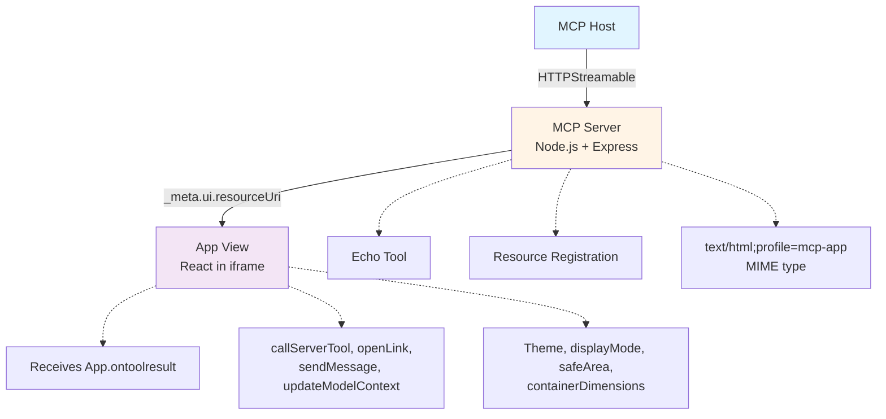
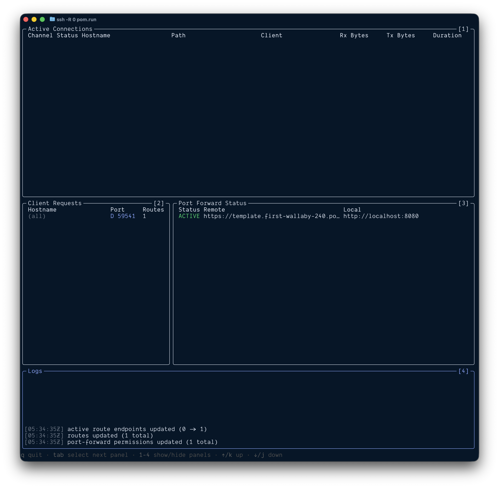
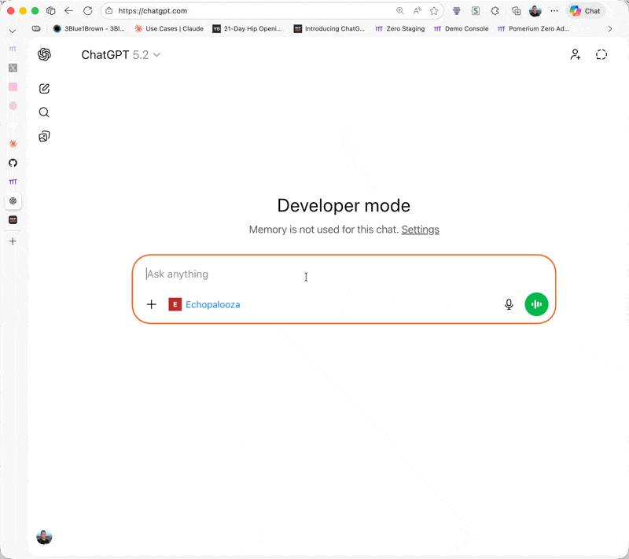

# MCP Apps Template

A well-architected starter template demonstrating best practices for building MCP Apps using the [Model Context Protocol](https://modelcontextprotocol.io/) (MCP) with [React](https://react.dev/) widgets. It leverages TypeScript, Tailwind CSS v4, Pino logging, Storybook, and Vitest for a robust development experience.

## Features

- **MCP Server** - Node.js server with `McpServer` and MCP Apps helpers
- **Echo Tool** - Example tool with [Zod](https://zod.dev/) validation and UI binding
- **React Widgets** - Interactive Echo component with MCP Apps `App` API demo
- **Display Modes** - Inline, picture-in-picture, and fullscreen with runtime toggling via `requestDisplayMode()`
- **App API Demo** - `callServerTool`, `openLink`, `sendMessage`, `updateModelContext` showcased in the Echo widget
- **UI Capability Negotiation** - Server detects host capabilities and falls back to text-only for non-UI clients
- **Inline Widget Assets** - Self-contained HTML mode for hosts that sandbox iframes (e.g. Claude.ai)
- **Container Dimensions** - Responsive widget sizing using host-provided `containerDimensions`
- **Mock App** - Drop-in `createMockApp()` helper for testing and Storybook without a live MCP connection
- **[Pino](https://getpino.io/) Logging** - Structured logging with pretty printing in development
- **TypeScript** - Strict mode with ES2023 target
- **[Tailwind CSS v4](https://tailwindcss.com/)** - Modern styling with dark mode support
- **[Storybook](https://storybook.js.org/)** - Component development with a11y addon
- **Testing** - [Vitest](https://vitest.dev/) for server and widgets with accessibility checks
- **Build Optimizations** - Parallel builds, content hashing, compression
- **[Docker](https://www.docker.com/)** - Multi-stage builds with health checks
- **Production Ready** - Session management, graceful shutdown, error handling

## Architecture


```mermaid
graph TD
    A[MCP Host] -->|HTTPStreamable| B[MCP Server<br/>Node.js + Express]
    B -->|_meta.ui.resourceUri| C[App View<br/>React in iframe]

    B -.-> B1[Echo Tool]
    B -.-> B2[Resource Registration]
    B -.-> B3[text/html;profile=mcp-app<br/>MIME type]

    C -.-> C1[Receives App.ontoolresult]
    C -.-> C2[callServerTool, openLink,<br/>sendMessage, updateModelContext]
    C -.-> C3[Theme, displayMode, safeArea,<br/>containerDimensions]

    style A fill:#e1f5ff
    style B fill:#fff4e6
    style C fill:#f3e5f5
```

## Quick Start

**Setup time: ~5 minutes (first time)**

### Prerequisites

- **[Node.js](https://nodejs.org/) 22+** (required for ES2023 support)
  - Verify: `node -v` (should show v22.0.0 or higher)
- **npm 10+** (ships with Node 22)
  - Verify: `npm -v` (should show v10.0.0 or higher)

**Supported platforms:** macOS, Linux, Windows (via WSL2)

### Installation & Setup

```bash
git clone https://github.com/pomerium/chatgpt-app-typescript-template your-chatgpt-app
cd your-chatgpt-app
npm install
npm run dev
```

This starts both the MCP server and widget dev server:

- **MCP Server**: `http://localhost:8080`
- **Widget Assets**: `http://localhost:4444`

> **Note:** The MCP server is a backend service. To test it, follow the host connection steps below (ChatGPT example) or use `npm run inspect` for local testing.

You should see output indicating both servers are running successfully:

```
❯ npm run dev

> chatgpt-app-typescript-template@1.0.0 dev
> concurrently "npm run dev:server" "npm run dev:widgets"

[1]
[1] > chatgpt-app-typescript-template@1.0.0 dev:widgets
[1] > npm run dev --workspace=widgets
[1]
[0]
[0] > chatgpt-app-typescript-template@1.0.0 dev:server
[0] > npm run dev --workspace=server
[0]
[1]
[1] > chatgpt-app-widgets@1.0.0 dev
[1] > vite
[1]
[0]
[0] > chatgpt-app-server@1.0.0 dev
[0] > tsx watch src/server.ts
[0]
[1]
[1] Found 1 widget(s):
[1]   - echo
[1]
[1]
[1]   VITE v6.4.1  ready in 151 ms
[1]
[1]   ➜  Local:   http://localhost:4444/
[1]   ➜  Network: use --host to expose
[0] [12:45:12] INFO: Starting MCP App Template server
[0]     port: 8080
[0]     nodeEnv: "development"
[0]     logLevel: "info"
[0]     assetsDir: "/Users/nicktaylor/dev/oss/chatgpt-app-typescript-template/assets"
[0] [12:45:12] INFO: Server started successfully
[0]     port: 8080
[0]     mcpEndpoint: "http://localhost:8080/mcp"
[0]     healthEndpoint: "http://localhost:8080/health"
```

### Connect to a Host (ChatGPT example)

To test your app in ChatGPT, you need to expose your local server publicly. The fastest way is using [Pomerium's SSH tunnel](https://www.pomerium.com/docs/tcp/ssh):

**1. Create a public tunnel** (in a new terminal, keep `npm run dev` running):

```bash
ssh -R 0 pom.run
```

**First-time setup:**

1. You'll see a sign-in URL in your terminal:

   ```
   Please sign in with hosted to continue
   https://data-plane-us-central1-1.dataplane.pomerium.com/.pomerium/sign_in?user_code=some-code
   ```

2. Click the link and sign up
3. Authorize via the Pomerium OAuth flow
4. Your terminal will display connection details:



**2. Find your public URL:**

Look for the **Port Forward Status** section showing:

- **Status**: `ACTIVE` (tunnel is running)
- **Remote**: `https://template.first-wallaby-240.pom.run` (your unique URL)
- **Local**: `http://localhost:8080` (your local server)

**3. Add to ChatGPT:**

1. Enable MCP apps dev mode in your ChatGPT settings
2. Go to: **Settings → Connectors → Add Connector**
3. Enter your Remote URL + `/mcp`, e.g. `https://template.first-wallaby-240.pom.run/mcp`
4. Save the connector

**4. Test it:**

1. Start a new chat in ChatGPT
2. Add your app to the chat
3. Send: `echo today is a great day`
4. You should see the message displayed in an interactive widget



The tunnel stays active as long as the SSH session is running.

**Other hosts:** Claude Desktop, VS Code, Goose, and other MCP Apps hosts follow the same pattern—add a connector to your `/mcp` endpoint and refresh after changes.

### Success! What's Next?

Now that your app is working, you can:

- **[Customize the echo tool](#adding-new-tools)** - Modify the example tool or add your own logic
- **[Create a new widget](#widget-development)** - Build custom UI components for your tools
- **[Test locally](#local-testing-with-mcp-inspector)** - Use `npm run inspect` for debugging without a host
- **[Deploy to production](#production-deployment)** - Take your app live when ready

## Available Commands

### Development

```bash
# Start everything (server + widgets in watch mode)
npm run dev

# Start for Claude.ai local dev (inlined assets + watch rebuild)
npm run dev:claude

# Start only MCP server (watch mode)
npm run dev:server

# Start only widget dev server
npm run dev:widgets

# Test with MCP Inspector
npm run inspect
```

### Building

```bash
# Full production build (widgets + server)
npm run build

# Build only widgets
npm run build:widgets

# Build only server
npm run build:server
```

### Testing

```bash
# Run all tests
npm test

# Run server tests only
npm run test:server

# Run widget tests only
npm run test:widgets

# Run tests with coverage
npm run test:coverage
```

### Code Quality

```bash
# Lint all TypeScript files
npm run lint

# Format code with Prettier
npm run format

# Check formatting without modifying
npm run format:check

# Type check all workspaces
npm run type-check
```

### Storybook

```bash
# Run Storybook dev server
npm run storybook

# Build Storybook for production
npm run build:storybook
```

### Testing Your App

#### 1. Local Testing with MCP Inspector

```bash
npm run inspect
```

This opens a browser interface to:

- List available tools
- Test tool invocations
- Inspect responses and metadata
- Verify widget resources load correctly

#### 2. Connect from ChatGPT

For complete ChatGPT connection instructions, see the [Quick Start: Connect to a Host](#connect-to-a-host-chatgpt-example) section above.

**Already connected?** After making code changes:

1. **Settings → Connectors → Your App → Refresh**
2. This reloads tool definitions and metadata

**Production Setup:**

When deploying to production:

1. Deploy your server to a public URL (see [Production Deployment](#production-deployment))
2. In ChatGPT: **Settings → Connectors → Add Connector**
3. Enter your server URL: `https://your-domain.com/mcp`
4. Test the `echo` tool in ChatGPT

## Project Structure

```
chatgpt-app-template/
├── server/                  # MCP server
│   ├── src/
│   │   ├── server.ts       # Main server with echo tool
│   │   ├── types.ts        # Type definitions
│   │   └── utils/
│   │       └── session.ts  # Session management
│   ├── tests/
│   │   └── echo-tool.test.ts
│   └── package.json        # Server dependencies
│
├── widgets/                 # React widgets
│   ├── src/
│   │   ├── widgets/
│   │   │   └── echo.tsx           # Widget entry (includes mounting code)
│   │   ├── echo/
│   │   │   ├── Echo.tsx           # Shared components
│   │   │   ├── Echo.stories.tsx
│   │   │   └── styles.css
│   │   ├── components/
│   │   │   └── ui/              # ShadCN components
│   │   ├── mocks/
│   │   │   └── mock-app.ts       # MCP Apps mock for tests/stories
│   │   └── types/
│   │       └── mcp-app.ts        # MCP Apps types for UI wiring
│   ├── .storybook/         # Storybook config
│   └── package.json        # Widget dependencies
│
├── assets/                  # Asset build artifacts
│   ├── echo.html
│   ├── echo-[hash].js
│   └── echo-[hash].css
│
├── scripts/
│   └── build-all.mts       # Parallel widget builds
│
├── docker/
│   ├── Dockerfile          # Multi-stage build
│   └── docker-compose.yml
│
└── package.json            # Root workspace
```

## Adding New Tools

### 1. Define Tool Schema

```typescript
// server/src/types.ts
export const MyToolInputSchema = z.object({
  input: z.string().min(1, 'Input is required'),
});
```

### 2. Register Tool (with UI)

```typescript
registerAppTool(
  server,
  'my_tool',
  {
    title: 'My Tool',
    description: 'Does something cool',
    inputSchema: {
      type: 'object',
      properties: {
        input: { type: 'string', description: 'Tool input' },
      },
      required: ['input'],
    },
    _meta: {
      ui: { resourceUri: 'ui://my-widget' },
    },
  },
  async (args) => {
    const input = MyToolInputSchema.parse(args).input;
    return {
      content: [{ type: 'text', text: 'Result' }],
      structuredContent: { result: input },
    };
  }
);
```

### 3. Create Widget

Create `widgets/src/widgets/my-widget.tsx`:

```tsx
// widgets/src/widgets/my-widget.tsx
import { StrictMode } from 'react';
import { createRoot } from 'react-dom/client';
import { App } from '@modelcontextprotocol/ext-apps';
import { useEffect, useState } from 'react';

function MyWidget() {
  const [toolOutput, setToolOutput] = useState(null);
  const [theme, setTheme] = useState('light');

  useEffect(() => {
    const app = new App({ name: 'MyWidget', version: '1.0.0' });
    app.ontoolresult = (result) => setToolOutput(result.structuredContent ?? null);
    app.onhostcontextchanged = (context) => setTheme(context?.theme ?? 'light');
    app.connect();
  }, []);

  return (
    <div className={theme === 'dark' ? 'dark' : ''}>
      <h1>My Widget</h1>
      <pre>{JSON.stringify(toolOutput, null, 2)}</pre>
    </div>
  );
}

// Mounting code - required at the bottom of each widget file
const rootElement = document.getElementById('my-widget-root');
if (rootElement) {
  createRoot(rootElement).render(
    <StrictMode>
      <MyWidget />
    </StrictMode>
  );
}
```

### 4. Register Widget Resource

```typescript
registerAppResource(
  server,
  'ui://my-widget',
  'ui://my-widget',
  { mimeType: RESOURCE_MIME_TYPE },
  async () => ({
    contents: [
      {
        uri: 'ui://my-widget',
        mimeType: RESOURCE_MIME_TYPE,
        text: await readWidgetHtml('my-widget'),
      },
    ],
  })
);
```

### 5. Build

```bash
npm run build:widgets
npm run dev:server
```

The build script auto-discovers widgets in `widgets/src/widgets/*.{tsx,jsx}` and bundles them with their mounting code

## Widget Development

### Widget Pattern

Widgets include both the component and mounting code:

**1. Create widget entry point** in `widgets/src/widgets/[name].tsx`:

```tsx
import { StrictMode } from 'react';
import { createRoot } from 'react-dom/client';
import { useEffect, useState } from 'react';
import { App } from '@modelcontextprotocol/ext-apps';

function MyWidget() {
  const [toolOutput, setToolOutput] = useState(null);

  useEffect(() => {
    const app = new App({ name: 'MyWidget', version: '1.0.0' });
    app.ontoolresult = (result) => setToolOutput(result.structuredContent ?? null);
    app.connect();
  }, []);
  return <div>Widget content</div>;
}

// Mounting code - required
const rootElement = document.getElementById('my-widget-root');
if (rootElement) {
  createRoot(rootElement).render(
    <StrictMode>
      <MyWidget />
    </StrictMode>
  );
}
```

**2. Build discovers and bundles widget**:

```bash
npm run build:widgets
```

**3. Widget available as** `ui://my-widget`

The build system:

- Auto-discovers all files in `widgets/src/widgets/*.{tsx,jsx}`
- Bundles the component and mounting code together
- Creates content-hashed bundles and HTML templates

### MCP Apps `App` API Reference

#### Tool Results & Host Context

```typescript
const app = new App({ name: 'Echo', version: '1.0.0' });
app.ontoolresult = (result) => {
  console.log(result.structuredContent);
};
app.onhostcontextchanged = (context) => {
  console.log(context?.theme, context?.displayMode);
};
await app.connect();
```

#### Display Modes

Widgets can run in three display modes provided by the host:

- **`inline`** — Rendered within the chat message flow (default)
- **`pip`** — Picture-in-picture floating window
- **`fullscreen`** — Full-screen overlay

The current mode is available via `hostContext.displayMode`. Widgets can request a mode change at runtime:

```typescript
// Toggle between inline and fullscreen
const result = await app.requestDisplayMode({ mode: 'fullscreen' });
console.log(result.mode); // the mode the host actually switched to
```

The host decides whether to honor the request — always use the returned `result.mode` as the source of truth.

#### Container Dimensions

Hosts provide `containerDimensions` in the host context so widgets can size themselves responsively:

```typescript
app.onhostcontextchanged = (context) => {
  const { maxHeight, maxWidth } = context?.containerDimensions ?? {};
  // Use maxHeight/maxWidth to constrain your layout
};
```

This replaces viewport-based sizing and ensures widgets respect the host's available space (especially important in inline mode).

#### Runtime APIs

```typescript
// Call other tools from the widget
const result = await app.callServerTool({
  name: 'tool_name',
  arguments: { arg: 'value' },
});

// Open an external link via the host
await app.openLink({ url: 'https://example.com' });

// Send a message to the host chat
await app.sendMessage({
  role: 'user',
  content: [{ type: 'text', text: 'Hello from the widget!' }],
});

// Push widget state to the model context for future turns
await app.updateModelContext({
  content: [{ type: 'text', text: 'Current widget state summary' }],
  structuredContent: { key: 'value' },
});

// Toggle display mode
await app.requestDisplayMode({ mode: 'fullscreen' });
```

### UI Capability Negotiation

The server inspects the client's capabilities during session initialization and adapts its responses:

- **UI-capable hosts** (ChatGPT, VS Code, etc.) — Tools include `_meta.ui.resourceUri` and return `structuredContent` for the widget to render
- **Text-only hosts** (terminal clients, basic MCP consumers) — Tools omit UI metadata and return plain text responses

This happens automatically via `getUiCapability()` from `@modelcontextprotocol/ext-apps/server`. No widget changes are needed — the server handles the fallback.

### Inline Widget Assets

Some hosts (e.g. Claude.ai) require fully self-contained HTML — external `<script>` and `<link>` tags won't load inside their sandboxed iframes.

**For local development with Claude.ai**, use the dedicated dev script:

```bash
npm run dev:claude
```

This sets `INLINE_WIDGET_ASSETS=true` automatically and runs the widget build in watch mode — so file changes are rebuilt into `assets/` and the server serves updated inlined HTML on the next tool call. No manual rebuild step needed.

**For production**, set the environment variable:

```bash
INLINE_WIDGET_ASSETS=true
```

When enabled, the server reads the built JS and CSS files from `assets/` and inlines them directly into the HTML as `<script>` and `<style>` blocks, removing any `<link rel="modulepreload">` or `<link rel="preload">` hints. This produces a single self-contained HTML document that works in any host.

### Mock App for Testing & Storybook

The `createMockApp()` helper (`widgets/src/mocks/mock-app.ts`) provides a drop-in replacement for the real `App` instance, making it easy to test widgets and develop them in Storybook without a live MCP connection:

```typescript
import { createMockApp } from '../mocks/mock-app';

const mockApp = createMockApp({
  toolOutput: { echoedMessage: 'Hello', timestamp: '2025-01-01T00:00:00Z' },
  hostContext: { theme: 'dark', displayMode: 'inline' },
});

// Pass to your widget
<Echo app={mockApp} />

// Simulate new tool results or context changes
mockApp.emitToolResult({ echoedMessage: 'Updated', timestamp: '...' });
mockApp.setHostContext({ theme: 'light', displayMode: 'fullscreen' });
```

### Example: Full Widget with Safe Area

```tsx
// widgets/src/widgets/my-widget.tsx
import { StrictMode, useEffect, useState } from 'react';
import { createRoot } from 'react-dom/client';
import { App } from '@modelcontextprotocol/ext-apps';

function MyWidget() {
  const [toolOutput, setToolOutput] = useState(null);
  const [theme, setTheme] = useState('light');
  const [safeAreaInsets, setSafeAreaInsets] = useState({
    top: 0,
    bottom: 0,
  });

  useEffect(() => {
    const app = new App({ name: 'MyWidget', version: '1.0.0' });
    app.ontoolresult = (result) => setToolOutput(result.structuredContent ?? null);
    app.onhostcontextchanged = (context) => {
      setTheme(context?.theme ?? 'light');
      setSafeAreaInsets({
        top: context?.safeAreaInsets?.top ?? 0,
        bottom: context?.safeAreaInsets?.bottom ?? 0,
      });
    };
    app.connect();
  }, []);

  const containerStyle = {
    paddingTop: safeAreaInsets.top,
    paddingBottom: safeAreaInsets.bottom,
  };

  return (
    <div style={containerStyle} className={theme === 'dark' ? 'dark' : ''}>
      <h1>My Widget</h1>
      <p>Tool output: {JSON.stringify(toolOutput)}</p>
    </div>
  );
}

// Mounting code - required at the bottom of each widget file
const rootElement = document.getElementById('my-widget-root');
if (rootElement) {
  createRoot(rootElement).render(
    <StrictMode>
      <MyWidget />
    </StrictMode>
  );
}
```

## Configuration

### Environment Variables

Create `.env` file (see `.env.example`):

```bash
# Server
NODE_ENV=development
PORT=8080
LOG_LEVEL=info          # fatal, error, warn, info, debug, trace

# Session Management
SESSION_MAX_AGE=3600000 # 1 hour in milliseconds

# CORS (development)
CORS_ORIGIN=*

# Asset Base URL (for CDN)
# BASE_URL=https://cdn.example.com/assets

# Inline widget assets into HTML (for hosts like Claude.ai)
# INLINE_WIDGET_ASSETS=true
```

### Critical Configuration Notes

#### text/html;profile=mcp-app MIME Type

**Required** for MCP Apps hosts to load UI:

```typescript
return {
  contents: [
    {
      uri: 'ui://my-widget',
      mimeType: 'text/html;profile=mcp-app', // ← CRITICAL
      text: html,
    },
  ],
};
```

#### Bundle Size Limits

- **Widget bundles**: Warn at 500kb (configured in Vite)
- **Widget state**: Keep under 4,000 tokens for performance

## API Reference

### MCP Server Endpoints

| Endpoint                       | Method | Description                                           |
| ------------------------------ | ------ | ----------------------------------------------------- |
| `/health`                      | GET    | Health check (returns status, version, session count) |
| `/mcp`                         | GET    | SSE connection endpoint for MCP clients               |
| `/mcp/messages?sessionId=<id>` | POST   | Message handling for MCP protocol                     |

### Echo Tool Schema

```json
{
  "name": "echo",
  "description": "Echoes back the user's message in an interactive widget",
  "inputSchema": {
    "type": "object",
    "properties": {
      "message": {
        "type": "string",
        "description": "The message to echo back"
      }
    },
    "required": ["message"]
  }
}
```

### Tool Response Format

```typescript
{
  content: [{ type: 'text', text: 'Human-readable message' }],
  structuredContent: {
    // JSON data passed to the app via App.ontoolresult
    echoedMessage: 'Hello',
    timestamp: '2025-01-...'
  },
  // UI binding is defined in tool _meta.ui.resourceUri
}
```

## Testing & Quality Assurance

### Running Tests

```bash
# Run all tests (server + widgets)
npm test

# Run specific workspace tests
npm run test:server
npm run test:widgets

# Run with coverage report
npm run test:coverage
```

### Test Structure

**Server Tests** (`server/tests/`):

- Input validation with Zod
- Tool response structure
- Session management
- Error handling

**Widget Tests** (`widgets/tests/`):

- Component rendering
- User interactions
- Accessibility (a11y) compliance
- MCP Apps App API mocking

### MCP Inspector Workflow

```bash
# 1. Start server
npm run dev:server

# 2. Build widgets
npm run build:widgets

# 3. Test with Inspector
npm run inspect

# 4. Verify:
#    - Tools list correctly
#    - Tool invocations work
#    - Widget HTML loads
#    - structuredContent is correct
```

## Production Deployment

### Building for Production

The production build process compiles widgets with optimizations and prepares the server:

```bash
# Full production build
npm run build
```

This runs:

1. `npm run build:widgets` - Builds optimized widget bundles with content hashing
2. `npm run build:server` - Compiles TypeScript server code

**Build outputs:**

- `assets/` - Optimized widget bundles (JS/CSS with content hashes)
- `server/dist/` - Compiled server code

### Manual Deployment

```bash
# 1. Install dependencies
npm install

# 2. Build for production
npm run build

# 3. Start production server
NODE_ENV=production npm start
```

The server will:

- Serve MCP on `http://localhost:8080/mcp`
- Load pre-built widgets from `assets/`
- Use structured logging (JSON format)
- Run with production optimizations

### Docker Deployment

```bash
# Build image
docker build -f docker/Dockerfile -t chatgpt-app:latest .

# Run with docker-compose
docker-compose -f docker/docker-compose.yml up -d

# Check logs
docker-compose -f docker/docker-compose.yml logs -f

# Health check
curl http://localhost:8080/health
```

### Production Checklist

**Environment Variables:**

- Set `NODE_ENV=production`
- Configure `CORS_ORIGIN` to your domain (not `*`)
- Set `LOG_LEVEL=warn` or `error` for production
- Configure `SESSION_MAX_AGE` based on your use case
- Set `BASE_URL` if using a CDN for widget assets

**Deployment Requirements:**

- Deploy to a publicly accessible URL (most hosts require HTTPS)
- Ensure `assets/` directory is deployed with the server
- Configure reverse proxy if needed (nginx, Caddy, etc.)
- Set up SSL/TLS certificates

**Monitoring:**

- Monitor `/health` endpoint for server status
- Set up logging aggregation (Pino outputs JSON in production)
- Configure alerts for errors and performance issues

## Troubleshooting

### Widget Not Loading

**Symptom**: Widget doesn't appear in a host

**Solutions**:

1. Verify `text/html;profile=mcp-app` MIME type in resource registration
2. Check assets directory exists: `ls assets/`
3. Rebuild widgets: `npm run build:widgets`
4. Restart server and refresh connector in the host

### Tool Not Listed

**Symptom**: Tool doesn't appear in a host

**Solutions**:

1. Check server logs for errors
2. Test with MCP Inspector: `npm run inspect`
3. Refresh connector: Settings → Connectors → Refresh
4. Verify tool schema is valid JSON Schema

### Session Issues

**Symptom**: "Session not found" errors

**Solutions**:

1. Check `SESSION_MAX_AGE` setting
2. Review session cleanup logs
3. Ensure SSE connection is maintained
4. Check CORS configuration

### Build Failures

**Symptom**: `npm run build:widgets` fails

**Solutions**:

1. Clear node_modules: `rm -rf node_modules && npm install`
2. Check for TypeScript errors: `npm run type-check`
3. Verify all dependencies installed
4. Check Node.js version: `node -v` (should be 22+)

### Port Already in Use

**Symptom**: `Error: listen EADDRINUSE: address already in use :::8080`

**Solutions**:

1. Change port in `.env`: `PORT=3001`
2. Kill existing process: `lsof -ti:8080 | xargs kill`

## Architecture Decisions

### Why `McpServer` + MCP Apps Helpers?

The template uses `McpServer` from `@modelcontextprotocol/sdk/server/mcp.js` together with `@modelcontextprotocol/ext-apps/server` helpers because:

- `registerAppTool` and `registerAppResource` handle MCP Apps metadata wiring consistently
- Tool UI binding is declared with `_meta.ui.resourceUri` in one place
- The pattern is portable across MCP Apps hosts (ChatGPT, VS Code, Claude, Goose)

### Why Node.js 22 + ES2023?

- Native type stripping support
- Immutable array methods (`.toSorted()`, `.toReversed()`)
- Better performance and modern JavaScript features

### Why Tailwind CSS v4?

- Modern, performant, and well-documented
- Great dark mode support out of the box
- Smaller bundle sizes with new engine

### Why Pino for Logging?

- Fast, structured logging for production
- Pretty printing in development
- Easy integration with monitoring tools

## Contributing

Contributions welcome! Please:

1. Follow existing code style (ESLint + Prettier)
2. Add tests for new features
3. Update documentation
4. Ensure TypeScript strict mode compliance

## License

MIT

---

**Built with**:

- [MCP Apps Spec](https://modelcontextprotocol.github.io/ext-apps/api/)
- [Model Context Protocol](https://modelcontextprotocol.io/)
- [React 19](https://react.dev/)
- [Tailwind CSS v4](https://tailwindcss.com/)
- [Vite](https://vitejs.dev/)
- [Pino](https://getpino.io/)
